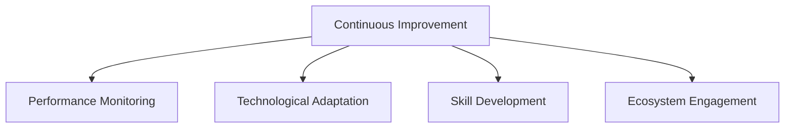
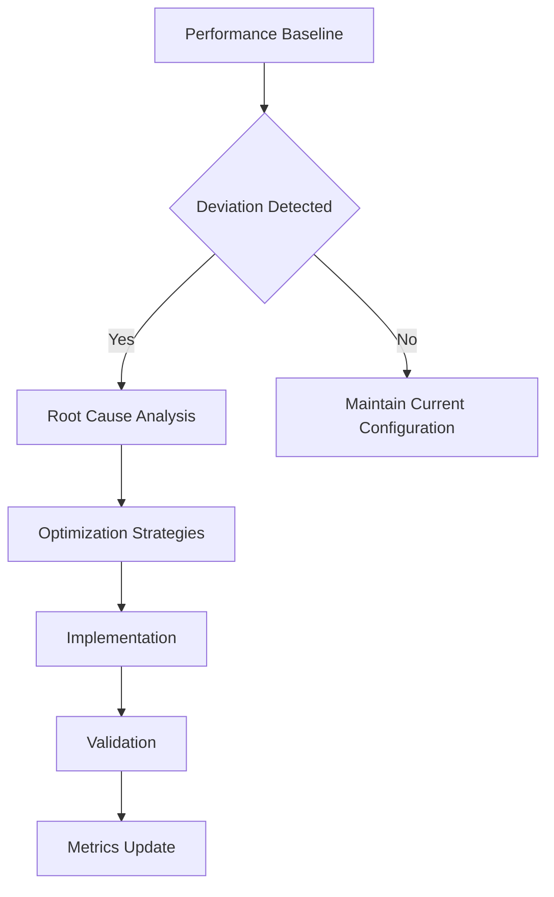

# Bun Migration Continuous Improvement Plan

## Vision
Establish a dynamic, adaptive approach to maintaining and evolving our package management ecosystem post-migration.

## Strategic Framework

## Improvement Dimensions

### 1. Performance Optimization Cycle

#### Monitoring Strategy
- **Frequency**: Quarterly comprehensive review
- **Metrics Tracked**:
  1. Dependency installation time
  2. Build process duration
  3. Runtime memory consumption
  4. Bundle size efficiency

#### Performance Improvement Workflow

### 2. Technological Adaptation Framework

#### Evaluation Criteria
- Emerging package management technologies
- JavaScript/TypeScript ecosystem developments
- Performance optimization techniques
- Developer productivity tools

#### Adaptation Process
1. Quarterly technology landscape review
2. Experimental proof of concepts
3. Risk-adjusted implementation
4. Continuous learning integration

### 3. Skill Development Roadmap

#### Learning Objectives
- Advanced Bun ecosystem knowledge
- Performance optimization techniques
- Modern JavaScript development practices
- Toolchain evolution understanding

#### Training Modules
1. **Foundational**
   - Bun advanced features
   - Performance profiling
   - Dependency management strategies

2. **Advanced**
   - Custom plugin development
   - Performance optimization techniques
   - Ecosystem integration patterns

### 4. Ecosystem Engagement

#### Community Interaction Channels
- Official Bun Discord
- GitHub discussions
- Conference presentations
- Open-source contributions

#### Knowledge Sharing Mechanisms
- Internal tech talks
- Quarterly innovation workshops
- Collaborative research projects
- External expert consultations

## Continuous Improvement Metrics

### Performance Tracking
| Metric | Current Baseline | Target Improvement | Tracking Frequency |
|--------|------------------|--------------------|--------------------|
| Installation Time | [value]s | 10% Reduction | Quarterly |
| Build Duration | [value]s | 15% Reduction | Quarterly |
| Runtime Memory | [value]MB | 20% Reduction | Quarterly |

### Skill Development Indicators
- Number of team certifications
- Complexity of implemented optimizations
- Contribution to open-source projects
- Internal knowledge sharing sessions

## Risk Management in Continuous Improvement

### Potential Challenges
1. Rapid technological changes
2. Skill gap development
3. Performance regression risks

### Mitigation Strategies
- Maintain flexible architecture
- Continuous learning budget
- Experimental branch for innovations
- Comprehensive testing infrastructure

## Governance and Accountability

### Roles and Responsibilities
- **Performance Champion**: Monitor technological trends
- **Learning Coordinator**: Develop skill development programs
- **Innovation Lead**: Manage experimental implementations

### Decision-Making Framework
- Data-driven approach
- Collaborative evaluation
- Transparent reporting
- Iterative refinement

## Implementation Roadmap

### Year 1 Milestones
- Q1: Baseline establishment
- Q2: Initial optimization cycle
- Q3: Advanced skill development
- Q4: Ecosystem engagement expansion

### Long-Term Vision
- Proactive technological leadership
- Continuous performance enhancement
- Adaptive development ecosystem

## Documentation and Transparency

### Reporting Mechanisms
- Quarterly performance reports
- Annual technological review
- Continuous improvement dashboard
- Open knowledge base

## Budget and Resources

### Investment Areas
- Training and certification
- Experimental technology exploration
- Performance monitoring tools
- Community engagement

## Version Control
- Version: 1.0
- Date: [Current Date]
- Prepared By: [Continuous Improvement Team]

## Appendices
- Performance tracking templates
- Learning resource recommendations
- Technological trend analysis