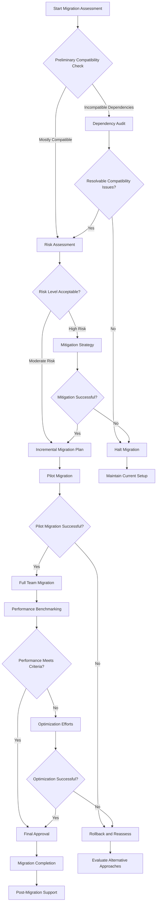

# Bun Migration Decision Flowchart

## Purpose
This document provides a structured decision-making process for migrating to the Bun package manager, offering clear guidance and decision points.

## Flowchart Representation



## Decision Points Explained

### 1. Preliminary Compatibility Check
- Assess overall project dependency compatibility
- Identify potential integration challenges
- Determine initial feasibility

### 2. Dependency Audit
- Comprehensive review of project dependencies
- Identify npm-specific or problematic packages
- Develop compatibility resolution strategy

### 3. Risk Assessment
- Evaluate technical and organizational risks
- Analyze potential performance impacts
- Develop risk mitigation strategies

### 4. Incremental Migration
- Implement staged migration approach
- Start with non-critical projects or components
- Validate each migration stage

### 5. Pilot Migration
- Select representative project or component
- Perform full migration in controlled environment
- Validate functionality and performance

### 6. Performance Benchmarking
- Conduct comprehensive performance testing
- Compare metrics with existing setup
- Identify potential optimization opportunities

### 7. Final Approval
- Review all migration data
- Obtain stakeholder consensus
- Make final migration decision

## Decision Criteria Checklist

### Technical Criteria
- [ ] 100% Dependency Compatibility
- [ ] Performance Improvement or Maintenance
- [ ] Minimal Disruption to Existing Workflows
- [ ] Successful Pilot Migration

### Organizational Criteria
- [ ] Team Readiness
- [ ] Training Completed
- [ ] Support Mechanisms in Place
- [ ] Rollback Strategy Defined

## Potential Outcomes

### Successful Migration
- Improved package management
- Enhanced development workflow
- Performance optimizations

### Migration Halted
- Maintain current package management
- Develop alternative modernization strategies
- Continuous evaluation of new tools

## Continuous Evaluation
- Regular toolchain assessment
- Stay informed about package manager developments
- Maintain flexibility in technological choices

## Version Control
- Version: 1.0
- Last Updated: [Current Date]
- Prepared By: [Technical Leadership]
```

## Appendix
- Detailed migration documentation
- Decision point evidence
- Performance benchmark reports