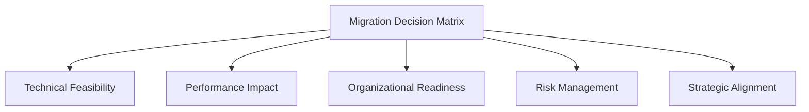
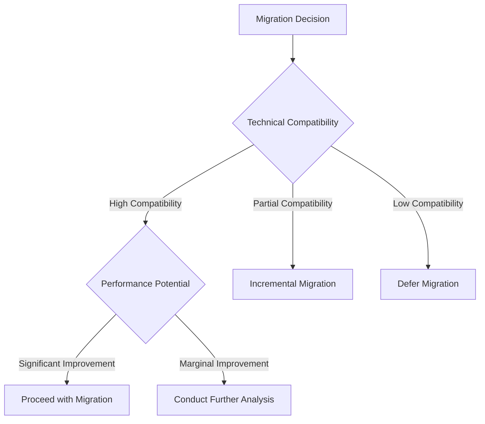

# Bun Migration Decision Matrix

## Strategic Decision Framework

### Objective
Provide a comprehensive, structured approach to evaluating and executing the Bun package manager migration.

## Decision Evaluation Dimensions

## Detailed Evaluation Criteria

### 1. Technical Feasibility

#### Dependency Compatibility
| Dependency Category | Compatibility Score | Mitigation Strategy |
|--------------------|---------------------|---------------------|
| Core Dependencies | [X]/100 | [Detailed Approach] |
| UI Libraries | [X]/100 | [Detailed Approach] |
| Build Tools | [X]/100 | [Detailed Approach] |
| Testing Frameworks | [X]/100 | [Detailed Approach] |

#### Scoring Methodology
- 0-25%: Significant Challenges
- 26-50%: Partial Compatibility
- 51-75%: Good Compatibility
- 76-100%: Excellent Compatibility

### 2. Performance Impact Analysis

#### Performance Metrics Comparison
| Metric | Current State | Bun Potential | Improvement |
|--------|--------------|--------------|-------------|
| Installation Time | [value]s | [value]s | [X]% Faster |
| Build Duration | [value]s | [value]s | [X]% Faster |
| Runtime Memory | [value]MB | [value]MB | [X]% Reduced |
| Bundle Size | [value]MB | [value]MB | [X]% Smaller |

### 3. Organizational Readiness

#### Skill Assessment Matrix
| Skill Area | Current Proficiency | Training Needs | Priority |
|------------|---------------------|----------------|----------|
| Bun Fundamentals | [Level] | [Detailed Needs] | High |
| Modern JavaScript Tooling | [Level] | [Detailed Needs] | Medium |
| Performance Optimization | [Level] | [Detailed Needs] | High |

### 4. Risk Management

#### Risk Evaluation
| Risk Category | Likelihood | Impact | Mitigation Strategy | Residual Risk |
|--------------|------------|--------|---------------------|---------------|
| Dependency Conflicts | [High/Medium/Low] | [High/Medium/Low] | [Detailed Strategy] | [Low/Medium/High] |
| Performance Variations | [High/Medium/Low] | [High/Medium/Low] | [Detailed Strategy] | [Low/Medium/High] |
| Team Adaptation | [High/Medium/Low] | [High/Medium/Low] | [Detailed Strategy] | [Low/Medium/High] |

### 5. Strategic Alignment

#### Strategic Evaluation Criteria
- [ ] Modernization of technology stack
- [ ] Improved developer productivity
- [ ] Future-ready infrastructure
- [ ] Ecosystem flexibility
- [ ] Performance optimization potential

## Decision Recommendation Framework

### Decision Tree

### Recommendation Levels
1. **Immediate Migration**
   - Excellent compatibility
   - Significant performance gains
   - Low migration risk

2. **Incremental Migration**
   - Partial compatibility
   - Moderate performance improvements
   - Managed risk approach

3. **Defer Migration**
   - Significant compatibility challenges
   - Minimal performance benefits
   - High migration risk

## Implementation Approach

### Phased Migration Strategy
1. Dependency Audit
2. Pilot Project Migration
3. Comprehensive Testing
4. Team Training
5. Full Rollout
6. Continuous Monitoring

## Decision Validation Checklist

### Pre-Migration Validation
- [ ] Comprehensive dependency compatibility
- [ ] Performance benchmark validation
- [ ] Team readiness assessment
- [ ] Risk mitigation strategies defined

### Post-Migration Validation
- [ ] Zero production regressions
- [ ] Performance improvement confirmation
- [ ] Team adaptation success
- [ ] Continuous improvement mechanisms

## Conclusion and Recommendation
**Recommended Action**: [Proceed/Incremental/Defer]
**Confidence Level**: [High/Medium/Low]

## Version Control
- Version: 1.0
- Date: [Current Date]
- Prepared By: [Decision Matrix Team]

## Appendices
- Detailed compatibility reports
- Performance benchmark data
- Risk assessment documentation