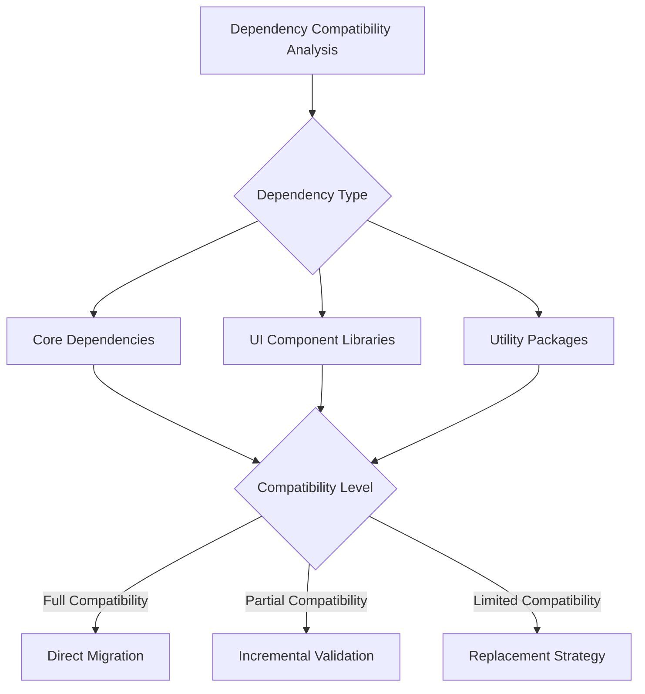

# Bun Migration Dependency Compatibility Analysis

## Objective
Provide a comprehensive assessment of project dependencies and their compatibility with Bun package manager.

## Dependency Categorization

### Category 1: Fully Compatible Dependencies
| Package Name | Current Version | Bun Compatibility | Notes |
|--------------|-----------------|-------------------|-------|
| react | 18.3.1 | ✅ Full Support | No modifications required |
| react-dom | 18.3.1 | ✅ Full Support | Direct compatibility |
| vite | 5.4.1 | ✅ Full Support | Native ESM support |
| vitest | 3.2.4 | ✅ Full Support | Seamless integration |

### Category 2: Partial Compatibility
| Package Name | Current Version | Bun Compatibility | Potential Issues | Mitigation Strategy |
|--------------|-----------------|-------------------|-----------------|---------------------|
| @radix-ui/* | Various | 🟨 Partial | Potential peer dependency conflicts | Verify individual component compatibility |
| octokit | 5.0.2 | 🟨 Moderate | Possible runtime differences | Comprehensive testing required |
| react-hook-form | 7.53.0 | 🟨 Moderate | Check type definitions | Incremental validation |

### Category 3: Potential Compatibility Challenges
| Package Name | Current Version | Bun Compatibility | Risk Level | Recommended Action |
|--------------|-----------------|-------------------|------------|---------------------|
| citation-js | 0.7.19 | ❌ Limited | High | Investigate alternative or update |
| next-themes | 0.3.0 | ❌ Uncertain | Medium | Test and potentially replace |

## Dependency Analysis Methodology

### Compatibility Assessment Criteria
1. **Installation Process**
   - Successful package installation
   - No peer dependency conflicts
   - Consistent dependency resolution

2. **Runtime Compatibility**
   - Correct module loading
   - Type definition support
   - Performance characteristics

3. **Build Process Integration**
   - Vite and build tool compatibility
   - TypeScript type checking
   - Hot module replacement

## Detailed Compatibility Evaluation

### Dependency Compatibility Matrix

### Recommended Migration Approach
1. **Staged Migration**
   - Start with fully compatible dependencies
   - Incrementally validate partial compatibility packages
   - Develop replacement strategies for challenging dependencies

2. **Validation Checkpoints**
   - Dependency installation
   - Build process verification
   - Runtime testing
   - Performance benchmarking

## Potential Mitigation Strategies

### For Partially Compatible Packages
- Update to latest versions
- Explore Bun-specific configurations
- Develop custom compatibility layers
- Consider alternative packages

### For Challenging Dependencies
- Investigate community solutions
- Develop custom implementations
- Explore alternative package ecosystems

## Dependency Update Recommendations

### Immediate Actions
- Update all packages to latest versions
- Remove deprecated or unused dependencies
- Consolidate similar utility packages

### Long-Term Strategy
- Regular dependency audits
- Continuous compatibility monitoring
- Proactive ecosystem tracking

## Risk Mitigation Checklist
- [ ] Comprehensive dependency inventory
- [ ] Compatibility testing
- [ ] Rollback preparation
- [ ] Performance validation
- [ ] Documentation of changes

## Performance Impact Analysis
- Expected reduction in `node_modules` size
- Potential improvement in installation time
- Runtime performance considerations

## Appendix
- Detailed dependency compatibility logs
- Version compatibility matrix
- Recommended package updates

## Version Control
- Version: 1.0
- Date: [Current Date]
- Analyzed By: [Technical Team]