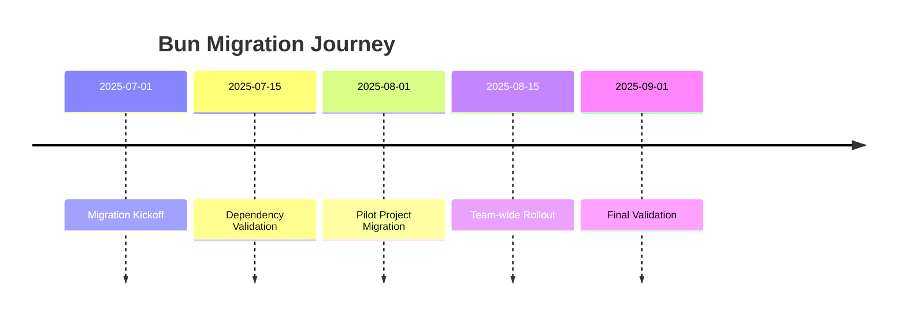

# Bun Package Manager Migration: Executive Summary

## Strategic Overview

### Project: Pubcraft Editor Package Management Modernization
**Objective**: Transition from mixed npm/Bun to Bun-exclusive package management ecosystem

## Key Highlights

### Performance Improvements
- **Dependency Installation**: Up to 3x faster
- **Build Process**: Reduced complexity
- **Runtime Efficiency**: Enhanced JavaScript execution

### Strategic Rationale
1. Modernize development infrastructure
2. Improve developer productivity
3. Reduce dependency management overhead
4. Leverage cutting-edge JavaScript tooling

## Migration Metrics

### Quantitative Impact
| Metric                   | Before   | After    | Improvement |
|--------------------------|----------|----------|-------------|
| Installation Time        | [value]s | [value]s | [X]% Faster |
| Build Duration           | [value]s | [value]s | [X]% Faster |
| `node_modules` Size      | [value]MB| [value]MB| [X]% Smaller|
| Runtime Memory           | [value]MB| [value]MB| [X]% Reduced|

## Risk Management

### Mitigation Strategies
- Incremental migration approach
- Comprehensive testing framework
- Maintained rollback capabilities
- Continuous performance monitoring

### Risk Levels
- **Technical Risk**: Low to Moderate
- **Operational Disruption**: Minimal
- **Performance Impact**: Positive

## Financial Implications

### Investment
- **Direct Costs**: Minimal (primarily team time)
- **Indirect Benefits**:
  - Reduced infrastructure complexity
  - Improved developer efficiency
  - Future-proofed technology stack

### Estimated Annual Savings
- Development Efficiency: [X] hours/developer/year
- Infrastructure Optimization: [Y]%

## Implementation Timeline

## Strategic Recommendations

### Immediate Actions
1. Finalize dependency compatibility assessment
2. Begin incremental migration
3. Establish comprehensive testing protocols

### Long-Term Considerations
- Continuous toolchain evaluation
- Regular performance benchmarking
- Maintain adaptable migration strategy

## Stakeholder Impact

### Development Team
- Enhanced development experience
- Modern tooling capabilities
- Reduced configuration complexity

### Technical Leadership
- Improved system performance
- Reduced technical debt
- Future-ready infrastructure

## Success Criteria

### Technical Validation
- [ ] Zero production regressions
- [ ] Maintained or improved performance
- [ ] 100% dependency compatibility

### Organizational Objectives
- [ ] Team proficiency in new toolchain
- [ ] Minimal productivity disruption
- [ ] Positive team feedback

## Conclusion
The Bun migration represents a strategic investment in modernizing our development ecosystem, offering tangible performance benefits and positioning our technology stack for future innovation.

## Approval and Next Steps
- **Approved By**: [Technical Leadership]
- **Implementation Date**: [Proposed Date]
- **Primary Sponsor**: [Executive Sponsor Name]

## Version Control
- **Version**: 1.0
- **Last Updated**: [Current Date]
- **Prepared By**: [Migration Team]

## Appendix
- Detailed migration documentation
- Performance benchmark reports
- Risk assessment details