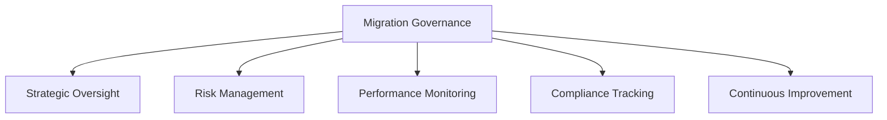
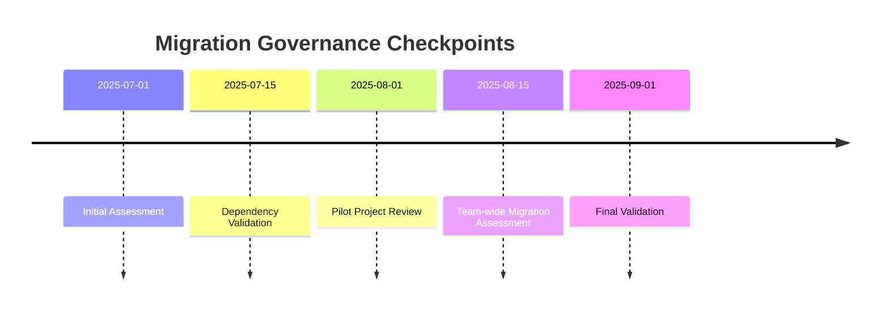

# Bun Migration Governance and Oversight Plan

## Purpose
Establish a structured framework for managing, monitoring, and governing the Bun package manager migration process.

## Governance Framework

## 1. Governance Structure

### Roles and Responsibilities

#### Migration Steering Committee
- **Composition**:
  1. Technical Lead
  2. Senior Developers
  3. DevOps Representative
  4. Performance Engineering Lead

#### Key Responsibilities
- Strategic decision-making
- Resource allocation
- Risk management
- Progress validation

### Decision-Making Hierarchy
1. **Strategic Level**: Migration Steering Committee
2. **Tactical Level**: Technical Working Group
3. **Operational Level**: Implementation Team

## 2. Oversight Mechanisms

### Governance Checkpoints

### Reporting Framework
- **Weekly Status Reports**
  - Progress tracking
  - Risk identification
  - Performance metrics

- **Monthly Comprehensive Review**
  - Detailed performance analysis
  - Strategic alignment
  - Future roadmap adjustments

## 3. Risk Management Protocol

### Risk Evaluation Matrix
| Risk Category | Likelihood | Impact | Mitigation Strategy | Ownership |
|--------------|------------|--------|---------------------|-----------|
| Dependency Conflicts | [H/M/L] | [H/M/L] | [Detailed Strategy] | [Owner] |
| Performance Degradation | [H/M/L] | [H/M/L] | [Detailed Strategy] | [Owner] |
| Team Adaptation | [H/M/L] | [H/M/L] | [Detailed Strategy] | [Owner] |

### Escalation Procedure
1. Identify risk
2. Document impact
3. Develop mitigation plan
4. Implement corrective actions
5. Monitor and report

## 4. Performance Monitoring

### Key Performance Indicators (KPIs)
- Dependency installation time
- Build process duration
- Runtime memory consumption
- Team productivity metrics

### Monitoring Tools and Techniques
- Performance profiling
- Continuous benchmarking
- Comparative analysis
- Automated performance tracking

## 5. Compliance and Standards

### Governance Standards
- Maintain technological best practices
- Ensure minimal disruption
- Prioritize team skill development
- Align with organizational goals

### Documentation Requirements
- Comprehensive migration logs
- Performance benchmark reports
- Risk assessment documentation
- Continuous improvement records

## 6. Change Management

### Change Control Process
1. Propose change
2. Impact assessment
3. Steering committee review
4. Controlled implementation
5. Post-implementation review

### Communication Protocols
- Transparent reporting
- Regular team updates
- Open feedback channels
- Collaborative decision-making

## 7. Continuous Improvement

### Improvement Cycle
- Quarterly technology landscape review
- Experimental proof of concepts
- Risk-adjusted implementation
- Lessons learned documentation

## 8. Budget and Resource Management

### Resource Allocation
- Training and certification
- Performance monitoring tools
- Experimental technology exploration
- Knowledge sharing initiatives

## 9. Success Criteria

### Validation Metrics
- Zero production regressions
- Performance improvement
- Team skill enhancement
- Minimal productivity disruption

## 10. Long-Term Governance

### Ongoing Responsibilities
- Technology trend monitoring
- Ecosystem engagement
- Continuous learning promotion
- Innovation cultivation

## Version Control
- Version: 1.0
- Date: [Current Date]
- Approved By: [Technical Leadership]

## Appendices
- Detailed governance charter
- Risk management templates
- Performance tracking guidelines