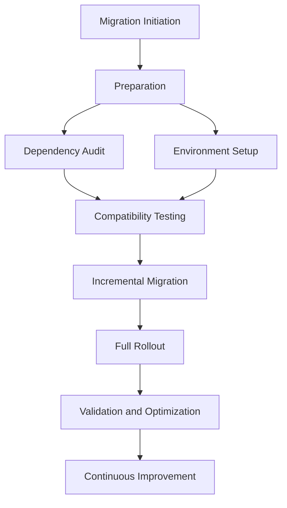

# Bun Migration Implementation Playbook

## Overview
A comprehensive, step-by-step guide for executing the Bun package manager migration with precision and minimal disruption.

## Migration Journey Visualization



## 1. Preparation Phase

### Pre-Migration Checklist
- [ ] Backup entire project repository
- [ ] Ensure Bun is installed (version 1.0+)
- [ ] Review all project dependencies
- [ ] Inform team about migration

### Environment Preparation
```bash
# Verify Bun installation
bun --version

# Create migration backup
git checkout -b bun-migration-backup
```

## 2. Dependency Ecosystem Analysis

### Dependency Compatibility Matrix
| Dependency | Current Version | Bun Compatibility | Action Required |
|------------|-----------------|-------------------|-----------------|
| react | 18.3.1 | ✅ Full Support | No action |
| vite | 5.4.1 | ✅ Full Support | No action |
| typescript | 5.5.3 | ✅ Full Support | No action |

### Compatibility Validation Script
```bash
# Dependency compatibility check
bun install --verbose
bun why [critical-packages]
```

## 3. Build Configuration Update

### Vite Configuration Adaptation
```typescript
// vite.config.ts
export default defineConfig({
  plugins: [
    // Bun-specific optimizations
    bunCompatibilityPlugin()
  ],
  build: {
    // Performance tracking
    reportCompressedSize: true
  }
});
```

## 4. Incremental Migration Strategy

### Phased Rollout Approach
1. **Pilot Project Migration**
   - Select non-critical project
   - Validate dependency resolution
   - Test build and runtime performance

2. **Dependency Replacement**
   ```bash
   # Remove existing node_modules
   rm -rf node_modules

   # Install with Bun
   bun install
   ```

3. **Build Process Validation**
   ```bash
   # Build validation
   bun run build
   bun test
   ```

## 5. Full Migration Execution

### Migration Command Sequence
```bash
# Remove npm artifacts
rm package-lock.json
rm -rf node_modules

# Install dependencies with Bun
bun install

# Update scripts in package.json
# Replace 'npm run' with 'bun run'

# Validate installation
bun run dev
bun test
bun run build
```

## 6. Performance Optimization

### Optimization Techniques
- Minimize unnecessary dependencies
- Leverage Bun's native bundling
- Optimize import statements
- Enable tree-shaking

### Performance Profiling
```bash
# Performance measurement
bun run --profile dev
bun build --timing
```

## 7. Troubleshooting Guide

### Common Migration Challenges
1. **Dependency Conflicts**
   - Use `bun install --force`
   - Check package compatibility
   - Update to latest versions

2. **Build Process Issues**
   ```bash
   # Diagnostic build command
   bun build --verbose
   ```

## 8. Rollback Mechanism

### Emergency Rollback Procedure
```bash
# Stash current changes
git stash

# Restore previous package management
npm install

# Revert configuration files
git checkout -- package.json vite.config.ts
```

## 9. Post-Migration Validation

### Comprehensive Checklist
- [ ] All dependencies install correctly
- [ ] Build process works
- [ ] Tests pass
- [ ] Performance maintained or improved
- [ ] No unexpected runtime behaviors

## 10. Continuous Monitoring

### Monitoring Tools
- Performance profiling scripts
- Continuous integration checks
- Regular dependency audits

## Version Control
- Version: 1.0
- Date: [Current Date]
- Prepared By: [Migration Team]

## Appendices
- Detailed migration logs template
- Troubleshooting quick reference
- Performance benchmark guidelines