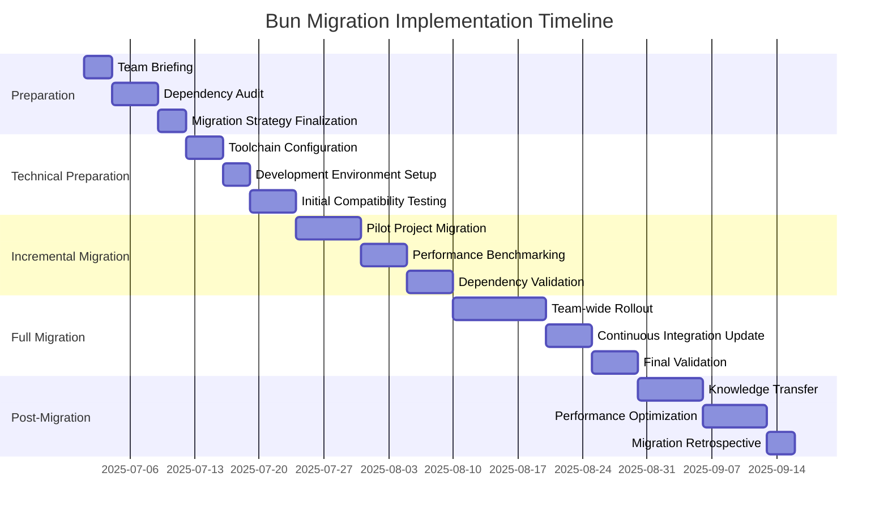

# Bun Migration Implementation Roadmap

## Project Overview
**Objective**: Seamless transition from mixed npm/Bun to Bun-exclusive package management

## Roadmap Visualization

## Detailed Phase Breakdown

### Phase 1: Preparation (2025-07-01 to 2025-07-09)
#### Objectives
- Comprehensive team briefing
- Dependency ecosystem analysis
- Migration strategy finalization

#### Key Deliverables
- [ ] Team communication document
- [ ] Dependency compatibility report
- [ ] Migration strategy validation

### Phase 2: Technical Preparation (2025-07-12 to 2025-07-19)
#### Objectives
- Configure development toolchain
- Set up Bun-compatible environment
- Initial compatibility testing

#### Key Deliverables
- [ ] Updated development configuration
- [ ] Bun environment setup script
- [ ] Initial compatibility test results

### Phase 3: Incremental Migration (2025-07-24 to 2025-08-05)
#### Objectives
- Migrate pilot project
- Conduct performance benchmarking
- Validate dependency interactions

#### Key Deliverables
- [ ] Pilot project successfully migrated
- [ ] Comprehensive performance benchmark report
- [ ] Dependency validation documentation

### Phase 4: Full Migration (2025-08-10 to 2025-08-25)
#### Objectives
- Team-wide Bun adoption
- Update continuous integration
- Final system validation

#### Key Deliverables
- [ ] Complete team migration
- [ ] Updated CI/CD pipelines
- [ ] Final migration validation report

### Phase 5: Post-Migration (2025-08-30 to 2025-09-13)
#### Objectives
- Knowledge transfer
- Performance optimization
- Migration retrospective

#### Key Deliverables
- [ ] Team training materials
- [ ] Performance optimization recommendations
- [ ] Comprehensive migration retrospective document

## Risk Mitigation Strategies

### Dependency Management
- Maintain npm fallback configuration
- Incremental dependency validation
- Comprehensive compatibility testing

### Performance Considerations
- Continuous performance benchmarking
- Identify and resolve bottlenecks
- Optimize build and runtime configurations

### Team Readiness
- Comprehensive training program
- Pair programming sessions
- Dedicated migration support channel

## Success Criteria

### Technical Criteria
- [ ] Zero production regressions
- [ ] Maintained or improved performance
- [ ] 100% dependency compatibility
- [ ] Successful CI/CD integration

### Organizational Criteria
- [ ] Team confidence in new toolchain
- [ ] Minimal productivity disruption
- [ ] Comprehensive knowledge transfer
- [ ] Positive team feedback

## Rollback Mechanism
- Preserved npm configuration
- Detailed rollback procedure
- Immediate fallback option

## Communication Plan
- Weekly migration status updates
- Dedicated Slack migration channel
- Regular team check-ins

## Resource Allocation
- Dedicated migration team
- Performance engineering support
- Training and knowledge transfer resources

## Monitoring and Reporting
- Daily migration progress tracking
- Performance metric collection
- Continuous feedback mechanism

## Version Control
- Version: 1.0
- Last Updated: [Current Date]
- Approved By: [Technical Leadership]

## Appendix
- Detailed migration documentation
- Performance benchmark templates
- Training and support resources