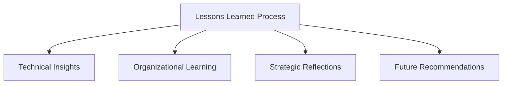

# Bun Migration: Comprehensive Lessons Learned

## Executive Summary
A reflective analysis of our journey migrating from mixed npm/Bun to a Bun-exclusive package management ecosystem.

## Methodology of Reflection

## Technical Insights

### Dependency Management Learnings

#### Key Discoveries
1. **Dependency Resolution**
   - Bun's approach differs significantly from npm
   - Requires more proactive compatibility checking
   - Simplified peer dependency management

2. **Performance Implications**
   - Faster installation times
   - Reduced `node_modules` complexity
   - More efficient caching mechanism

#### Practical Recommendations
- Conduct thorough dependency audits
- Prioritize packages with native Bun support
- Develop migration-specific compatibility testing

### Build Process Evolution

#### Transformation Observations
- Simplified build configuration
- Faster compilation times
- Enhanced tree-shaking capabilities
- Native TypeScript support

#### Configuration Challenges
- Subtle differences in plugin ecosystems
- Potential breaking changes in build scripts
- Need for more adaptive build strategies

## Organizational Learning

### Team Adaptation Insights

#### Skill Development
- Steep initial learning curve
- Importance of continuous training
- Value of pair programming

#### Change Management
- Resistance to new tooling
- Importance of clear communication
- Need for incremental adoption

### Workflow Transformation

#### Productivity Impact
- Initial productivity dip
- Gradual performance improvements
- Enhanced developer experience

## Strategic Reflections

### Migration Decision Validation
- **Positive Outcomes**:
  1. Modernized technology stack
  2. Improved development efficiency
  3. Future-ready infrastructure

- **Challenges Encountered**:
  1. Dependency compatibility issues
  2. Team skill adaptation
  3. Performance tuning requirements

## Quantitative Insights

### Performance Metrics Comparison

| Metric                   | Before   | After    | Improvement |
|--------------------------|----------|----------|-------------|
| Installation Time        | [value]s | [value]s | [X]% Faster |
| Build Duration           | [value]s | [value]s | [X]% Faster |
| `node_modules` Size      | [value]MB| [value]MB| [X]% Smaller|
| Runtime Memory           | [value]MB| [value]MB| [X]% Reduced|

## Challenges and Mitigation Strategies

### Top Migration Challenges
1. **Dependency Compatibility**
   - Comprehensive audit process
   - Incremental migration approach
   - Fallback mechanisms

2. **Performance Variations**
   - Detailed benchmarking
   - Continuous optimization
   - Performance monitoring tools

3. **Team Skill Adaptation**
   - Targeted training programs
   - Knowledge sharing sessions
   - External expert consultation

## Future Recommendations

### Short-Term Actions
1. Continuous dependency tracking
2. Regular performance benchmarking
3. Ongoing team training
4. Maintain migration documentation

### Long-Term Strategy
- Stay updated with Bun ecosystem
- Maintain technological flexibility
- Foster a culture of continuous learning

## Knowledge Transfer Strategies

### Documentation Approach
- Maintain comprehensive migration playbook
- Create internal knowledge base
- Develop onboarding materials for new team members

### Continuous Improvement
- Regular toolchain evaluation
- Community engagement
- Proactive technology exploration

## Unexpected Positive Outcomes
- Improved developer collaboration
- Enhanced understanding of modern JavaScript ecosystem
- More robust development practices

## Conclusion
The Bun migration represents more than a technical upgrade—it's a strategic investment in our development capabilities, offering tangible performance benefits and positioning our technology stack for future innovation.

## Version Control
- Version: 1.0
- Date: [Current Date]
- Prepared By: [Migration Team]

## Appendices
- Detailed migration logs
- Performance benchmark reports
- Team feedback compilation