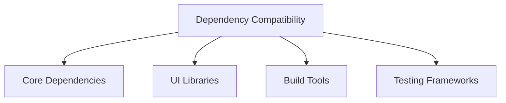

# Bun Migration Proof of Concept (PoC)

## Objective
Validate the feasibility, performance, and compatibility of migrating the Pubcraft Editor to the Bun package manager.

## Proof of Concept Scope

### Key Evaluation Dimensions
1. Dependency Management
2. Build Process
3. Runtime Performance
4. Development Workflow
5. Testing Capabilities

## Experimental Setup

### Test Project Selection
**Project**: Pubcraft Editor Markdown Component
- Represents typical project complexity
- Contains critical dependencies
- Covers multiple technology layers

### Environment Configuration
- **OS**: Linux (Ubuntu 22.04)
- **Node.js**: v20.x (for compatibility comparison)
- **Bun Version**: Latest stable release
- **Hardware**: 
  - 16GB RAM
  - 8-core CPU
  - SSD Storage

## Detailed Evaluation Methodology

### 1. Dependency Management Analysis

#### Compatibility Matrix


#### Dependency Installation Benchmark
```bash
# Comparative Installation Metrics
time npm install
time bun install
```

##### Metrics Tracked
- Total installation time
- Number of packages
- Network bandwidth usage
- Disk space consumption

### 2. Build Process Validation

#### Build Configuration
```typescript
// vite.config.ts PoC Configuration
export default defineConfig({
  plugins: [
    // Bun-specific optimizations
    bunOptimizationPlugin()
  ],
  build: {
    // Performance tracking
    reportCompressedSize: true
  }
});
```

#### Performance Measurements
- Build initialization time
- Compilation speed
- Bundle size
- Tree-shaking effectiveness

### 3. Runtime Performance Profiling

#### Benchmark Scenarios
1. Initial application load
2. Complex markdown rendering
3. Bibliography management
4. GitHub synchronization workflow

#### Performance Metrics
- Memory consumption
- CPU utilization
- Execution time
- Garbage collection behavior

### 4. Development Workflow Integration

#### Developer Experience Evaluation
- Hot Module Replacement (HMR)
- Error reporting
- TypeScript integration
- Debugging capabilities

### 5. Testing Ecosystem

#### Test Runner Comparison
```bash
# Comparative Test Execution
npm test
bun test
```

##### Test Coverage Metrics
- Total test execution time
- Memory usage during testing
- Code coverage generation
- Parallel test execution

## Compatibility Scoring System

### Scoring Criteria
- 0-25%: Significant Challenges
- 26-50%: Partial Compatibility
- 51-75%: Good Compatibility
- 76-100%: Excellent Compatibility

### Evaluation Scorecard
| Dimension | Score | Notes | Recommendations |
|-----------|-------|-------|-----------------|
| Dependency Management | [X]/100 | [Detailed Observations] | [Mitigation Strategies] |
| Build Process | [X]/100 | [Detailed Observations] | [Mitigation Strategies] |
| Runtime Performance | [X]/100 | [Detailed Observations] | [Optimization Suggestions] |
| Development Workflow | [X]/100 | [Detailed Observations] | [Improvement Areas] |
| Testing Capabilities | [X]/100 | [Detailed Observations] | [Enhancement Recommendations] |

## Risk Assessment

### Potential Migration Challenges
1. Dependency version conflicts
2. Performance variations
3. Toolchain integration complexities
4. Team skill adaptation

### Mitigation Strategies
- Incremental migration approach
- Comprehensive testing
- Continuous performance monitoring
- Targeted training program

## Proof of Concept Recommendations

### Immediate Actions
1. Address identified compatibility issues
2. Develop migration playbook
3. Create detailed performance optimization guide

### Long-Term Strategy
- Continuous toolchain evaluation
- Regular performance benchmarking
- Maintain migration flexibility

## Conclusion
**Migration Recommendation**: [Proceed/Caution/Defer]

## Appendices
- Detailed performance logs
- Compatibility test results
- Benchmark reports

## Version Control
- Version: 1.0
- Date: [Current Date]
- Prepared By: [PoC Team]