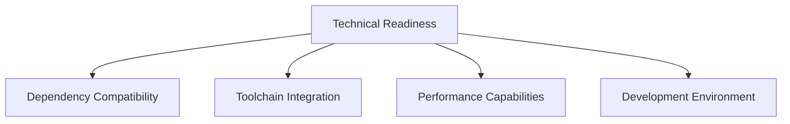
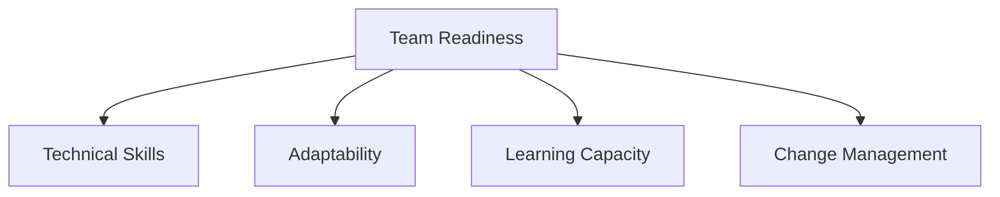

# Bun Migration Readiness Assessment

## Comprehensive Evaluation Framework

### Assessment Objective
Systematically evaluate the organization's preparedness for migrating to the Bun package manager.

## Readiness Scoring Matrix

### Technical Readiness

#### Scoring Methodology
- 0-25%: Significant Challenges
- 26-50%: Moderate Preparation Required
- 51-75%: Good Readiness
- 76-100%: Excellent Preparedness

### Detailed Evaluation Criteria

#### 1. Dependency Ecosystem
| Criteria | Assessment | Score | Notes |
|----------|------------|-------|-------|
| Dependency Compatibility | [Evaluation] | [X]/100 | Comprehensive audit of package compatibility |
| Peer Dependency Resolution | [Evaluation] | [X]/100 | Ability to resolve complex dependency trees |
| Type Definition Support | [Evaluation] | [X]/100 | TypeScript and type system integration |

#### 2. Development Infrastructure
| Criteria | Assessment | Score | Notes |
|----------|------------|-------|-------|
| Build Tool Compatibility | [Evaluation] | [X]/100 | Vite, webpack, and other build system integrations |
| CI/CD Pipeline Adaptability | [Evaluation] | [X]/100 | GitHub Actions, Jenkins compatibility |
| Testing Framework Support | [Evaluation] | [X]/100 | Vitest, Jest, and other testing tool integrations |

#### 3. Performance Capabilities
| Criteria | Assessment | Score | Notes |
|----------|------------|-------|-------|
| Installation Speed | [Benchmark] | [X]/100 | Comparative package installation performance |
| Build Process Efficiency | [Benchmark] | [X]/100 | Build time and resource utilization |
| Runtime Performance | [Benchmark] | [X]/100 | JavaScript execution and memory management |

## Organizational Readiness Assessment

### Team Skill Evaluation

#### Skill Proficiency Levels
- Novice: Limited understanding
- Intermediate: Basic working knowledge
- Advanced: Comprehensive expertise
- Expert: Thought leadership

### Team Skill Matrix
| Skill Area | Current Proficiency | Training Needs | Priority |
|------------|---------------------|----------------|----------|
| Bun Fundamentals | [Level] | [Detailed Needs] | High |
| Modern JavaScript Tooling | [Level] | [Detailed Needs] | Medium |
| Performance Optimization | [Level] | [Detailed Needs] | High |

## Risk and Mitigation Strategy

### Potential Migration Challenges
1. **Dependency Compatibility**
   - Comprehensive audit required
   - Incremental migration approach
   - Fallback mechanisms

2. **Skill Gap**
   - Targeted training program
   - Pair programming
   - External expert consultation

3. **Performance Variations**
   - Detailed benchmarking
   - Optimization strategies
   - Continuous monitoring

## Readiness Recommendations

### Immediate Actions
1. Conduct comprehensive dependency audit
2. Develop migration training program
3. Establish performance baseline
4. Create detailed migration playbook

### Short-Term Strategies
- Pilot project migration
- Incremental team training
- Continuous feedback mechanism

### Long-Term Vision
- Continuous learning culture
- Regular toolchain evaluation
- Performance-driven development approach

## Readiness Score Calculation

### Weighted Assessment
- Technical Readiness: 40%
- Organizational Preparedness: 30%
- Risk Mitigation: 20%
- Future Adaptability: 10%

**Total Readiness Score**: [X]/100

## Conclusion and Recommendations

### Migration Recommendation
- **Proceed with Caution**
- **Incremental Approach**
- **Continuous Validation**

## Appendix
- Detailed assessment methodology
- Supporting documentation
- Benchmark reports

## Version Control
- Version: 1.0
- Date: [Current Date]
- Prepared By: [Migration Assessment Team]