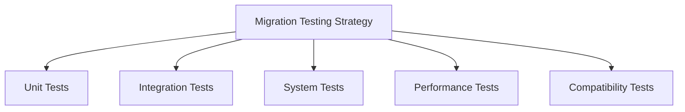

# Comprehensive Bun Migration Testing Strategy

## Objective
Develop a rigorous testing approach to ensure seamless migration to the Bun package manager while maintaining system integrity and performance.

## Testing Pyramid



## Testing Phases

### 1. Dependency Validation
#### Objective
Verify complete dependency compatibility and resolution

#### Test Scenarios
- [ ] All dependencies install correctly
- [ ] Peer dependencies resolve without conflicts
- [ ] No unexpected version downgrades
- [ ] Type definitions maintain integrity

#### Validation Script
```bash
# Dependency Installation Verification
bun install --verbose
bun why [critical-packages]
```

### 2. Build Process Testing

#### Build Configuration Validation
- [ ] Vite build process
- [ ] TypeScript compilation
- [ ] Source map generation
- [ ] Production build optimization

#### Test Matrix
| Build Configuration | Validation Status | Notes |
|--------------------|-------------------|-------|
| Development Build  | [ ]               |       |
| Production Build   | [ ]               |       |
| Server-Side Render | [ ]               |       |

### 3. Runtime Compatibility Tests

#### Compatibility Checklist
- [ ] Module loading (ESM/CJS)
- [ ] Async/await behavior
- [ ] Global object consistency
- [ ] Native module interactions
- [ ] Environment variable handling

#### Diagnostic Approach
```typescript
// Runtime compatibility diagnostic
function diagnoseRuntime() {
  console.log('Node.js Compatibility:', process.versions.node);
  console.log('Bun Version:', Bun.version);
  // Additional runtime checks
}
```

### 4. Performance Benchmarking

#### Performance Metrics
- Installation time
- Build duration
- Runtime memory consumption
- Cold start performance

#### Benchmark Script
```bash
# Performance measurement
hyperfine \
  'npm install' \
  'bun install' \
  --warmup 3 \
  --min-runs 10
```

### 5. Continuous Integration Validation

#### CI/CD Test Scenarios
- [ ] GitHub Actions workflow compatibility
- [ ] Test coverage generation
- [ ] Artifact publishing
- [ ] Deployment process

### 6. Comprehensive Test Coverage

#### Test Coverage Goals
- 90%+ Unit Test Coverage
- 80%+ Integration Test Coverage
- 100% Critical Path Coverage

#### Coverage Reporting
```bash
bun test --coverage
bun test --coverage-reporter=html
```

## Risk Mitigation Strategies

### Incremental Testing Approach
1. **Isolated Component Testing**
   - Test individual modules first
   - Validate before full system integration

2. **Parallel Environment Maintenance**
   - Keep existing npm configuration
   - Enable quick rollback if needed

3. **Comprehensive Logging**
   - Detailed error capturing
   - Performance metric logging

## Test Environment Configuration

### Testing Tools
- Vitest
- React Testing Library
- Bun Test Runner
- Performance profiling tools

### Configuration Template
```typescript
// bun.test.ts
import { expect, test } from 'bun:test';

test('Migration Readiness', () => {
  expect(process.env.BUN_MIGRATION_READY).toBe('true');
});
```

## Compatibility Verification Checklist

### Pre-Migration Checklist
- [ ] All dependencies compatible
- [ ] Build process validated
- [ ] Runtime environment stable
- [ ] Performance baseline established

### Post-Migration Validation
- [ ] Zero production regressions
- [ ] Performance maintained or improved
- [ ] No unexpected behavior changes

## Reporting and Documentation

### Test Report Structure
- Executive summary
- Detailed test results
- Performance comparisons
- Recommendations

### Metrics Tracking
- Installation time
- Build duration
- Memory consumption
- Test execution speed

## Escalation and Support

### Test Failure Workflow
1. Immediate notification
2. Detailed error analysis
3. Potential rollback preparation
4. Root cause investigation

## Version Control
- Version: 1.0
- Date: [Current Date]
- Prepared By: [Testing Team]

## Appendix
- Detailed test configurations
- Performance benchmark logs
- Compatibility test results