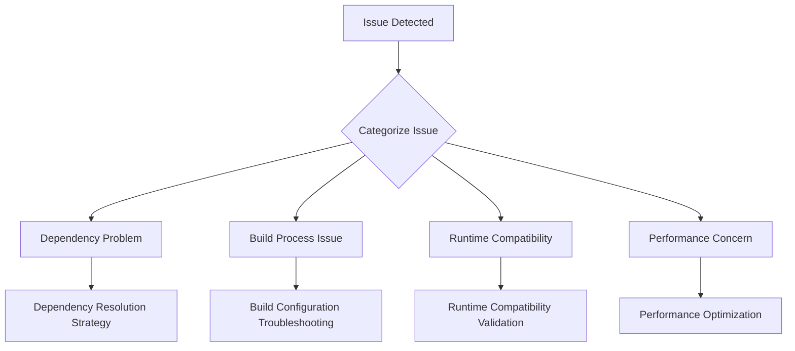

# Bun Migration Troubleshooting and Support Guide

## Objective
Provide comprehensive guidance for resolving potential issues during the Bun package manager migration.

## Troubleshooting Workflow


## Common Issue Categories and Solutions

### 1. Dependency Installation Problems

#### Symptom: Failed Package Installation
- **Diagnostic Steps**:
  ```bash
  # Check Bun version
  bun --version

  # Verbose installation log
  bun install --verbose

  # Clear Bun cache
  bun clean
  ```

- **Potential Solutions**:
  1. Update Bun to latest version
  2. Clear global and local package caches
  3. Verify network connectivity
  4. Check package registry access

#### Dependency Conflict Resolution
- **Conflict Detection**:
  ```bash
  # Identify conflicting dependencies
  bun install --force
  bun why [package-name]
  ```

- **Mitigation Strategies**:
  - Use explicit version constraints
  - Resolve peer dependency issues
  - Consider alternative package versions

### 2. Build Process Challenges

#### Build Configuration Troubleshooting
- **Vite Configuration Validation**:
  ```typescript
  // vite.config.ts diagnostic logging
  export default defineConfig({
    plugins: [
      // Add verbose logging
      {
        name: 'bun-migration-debug',
        buildStart() {
          console.log('Build process started');
        }
      }
    ]
  });
  ```

- **Common Build Issues**:
  1. Plugin compatibility
  2. TypeScript type resolution
  3. Module import variations

### 3. Runtime Compatibility

#### Debugging Runtime Issues
- **Diagnostic Techniques**:
  ```bash
  # Enable Node.js compatibility mode
  BUN_CONFIG_NODE_MODULES_TARGET=compat bun run dev

  # Verbose error logging
  NODE_OPTIONS="--trace-warnings" bun run start
  ```

- **Compatibility Checklist**:
  - [ ] Verify ESM/CJS module support
  - [ ] Check global object differences
  - [ ] Test async/await behaviors
  - [ ] Validate native module interactions

### 4. Performance Optimization

#### Performance Diagnostics
```bash
# Bun performance profiling
bun run --profile dev

# Dependency load time analysis
bun build --timing
```

#### Optimization Strategies
1. Minimize unnecessary dependencies
2. Use Bun's native bundling
3. Leverage tree-shaking
4. Optimize import statements

## Escalation Process

### Support Tiers
1. **Self-Service Troubleshooting**
   - Consult documentation
   - Run diagnostic scripts
   - Review error logs

2. **Peer Support**
   - Team Slack channel
   - Internal knowledge base
   - Pair debugging sessions

3. **Expert Intervention**
   - Technical lead consultation
   - Detailed issue investigation
   - Potential external support

## Emergency Rollback Procedure

### Rollback Checklist
- [ ] Stash current changes
- [ ] Restore `package-lock.json`
- [ ] Reinstall npm dependencies
- [ ] Verify original configuration
- [ ] Document rollback reasons

### Rollback Command Sequence
```bash
# Stash current state
git stash

# Restore previous package management
npm install

# Revert configuration files
git checkout -- package.json vite.config.ts
```

## Monitoring and Logging

### Logging Configuration
```typescript
// Enhanced logging configuration
const bunLogger = {
  level: 'debug',
  outputMode: 'json',
  destinations: [
    'console',
    '/var/log/bun-migration.log'
  ]
};
```

## Knowledge Base Integration
- Maintain living documentation
- Update troubleshooting guide regularly
- Capture and document unique migration challenges

## Community Resources
- Official Bun documentation
- GitHub issues tracker
- Community forums
- Discord support channels

## Version Control
- Version: 1.0
- Last Updated: [Current Date]
- Maintained By: [Technical Support Team]

## Appendix
- Diagnostic script templates
- Common error pattern references
- Performance optimization guidelines